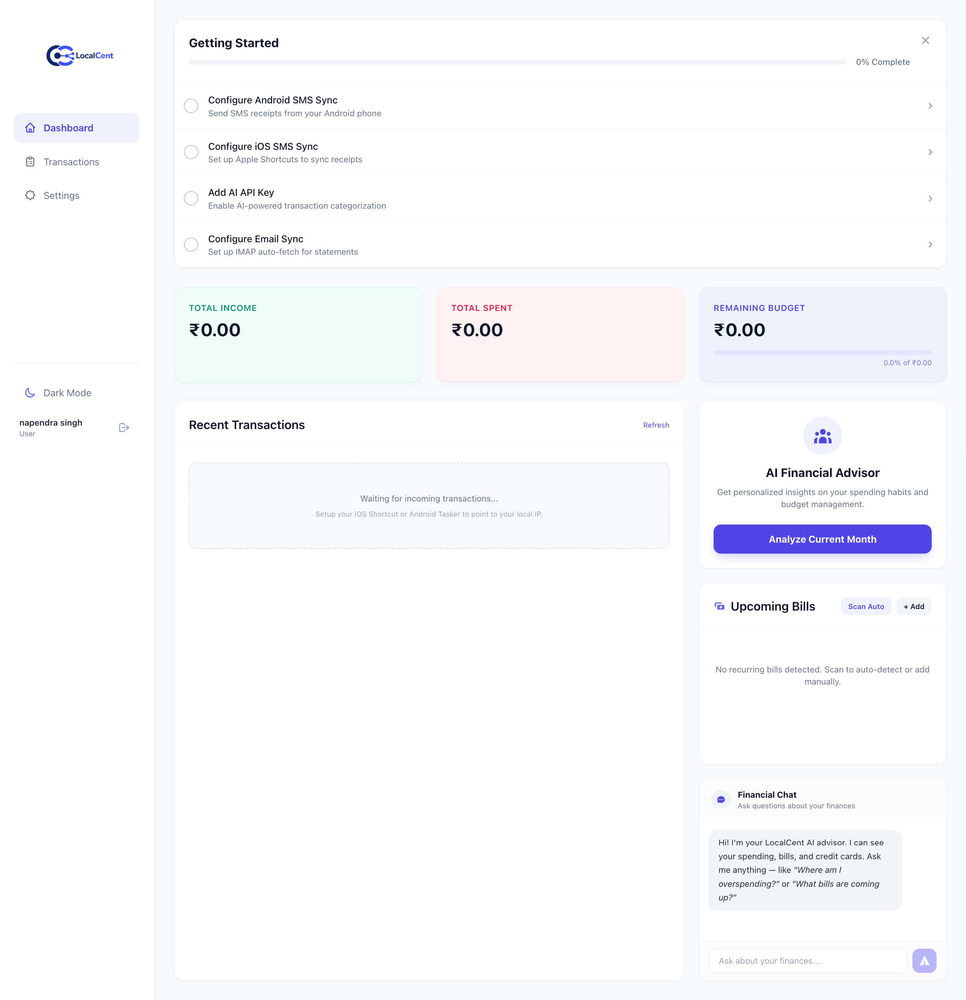
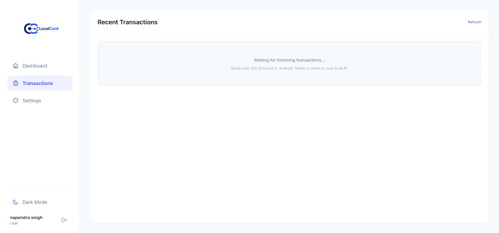
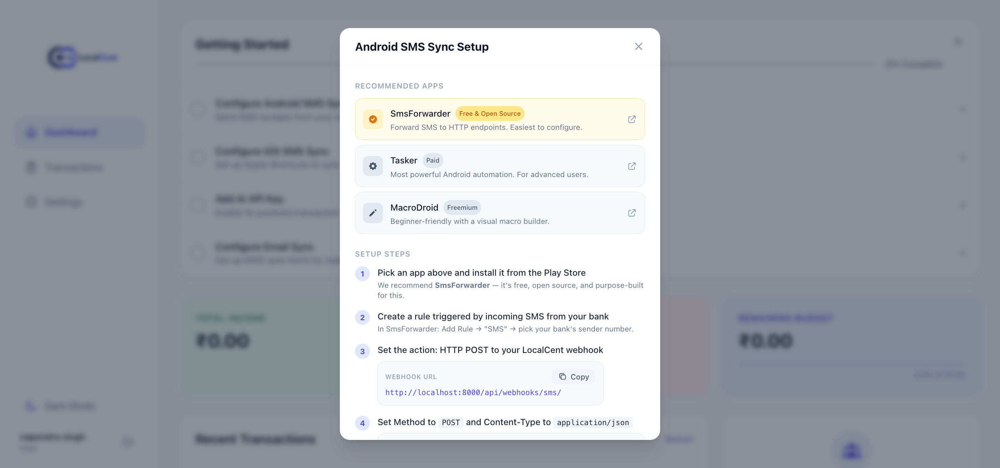
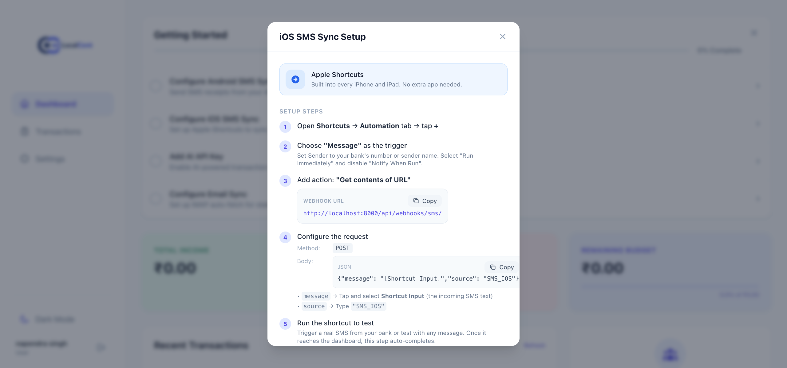
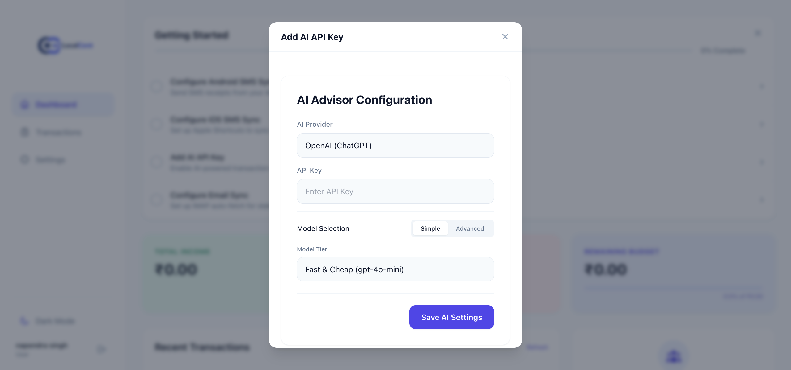
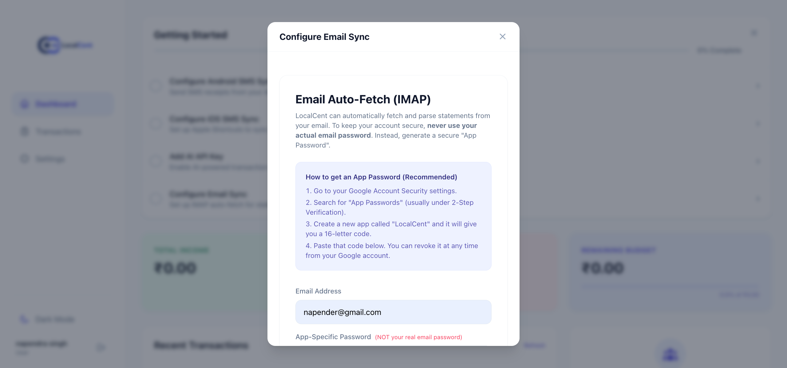

<div align="center">
  
  
  <p>
    <strong>A Hyper-Local, Privacy-First Personal Finance Tracker</strong>
  </p>

  <p>
    
    
    
    
  </p>
</div>

---

## 🛡️ Privacy First

LocalCent puts you in complete control. All of your financial data — transactions, bank statements, AI conversations — stays **on your machine**, stored locally and encrypted at rest. No cloud, no telemetry, no third-party servers. **Your wealth, your business.**

---

## ✨ Features

### 📊 Smart Dashboard
Live summary of income, spending, and remaining budget with month-over-month visibility. Beautifully responsive across desktop, tablet, and mobile.

### 💸 Transaction Tracking
Ingest transactions via SMS webhooks (Android / iOS Shortcuts), email PDF parsing, or manual entry. SHA-256 deduplication prevents duplicates across all sources.

### 🤖 AI Financial Advisor
One-click monthly analysis with actionable spending insights. Supports **OpenAI**, **Anthropic Claude**, **Google Gemini**, **DeepSeek**, and **Groq** with Simple (Fast / Smart) and Advanced (custom model) tier selection.

### 💬 Financial Chat
A conversational chat interface right on your dashboard. Ask questions like *"How much did I spend on food this month?"* or *"What bills are coming up?"* and get answers grounded in your actual transaction data, credit card statuses, and upcoming bills.

### 🔁 Recurring Bills Detection
Auto-scans your last 90 days of transactions and detects fixed monthly expenses (28–31 day cycles, ±10% amount tolerance). Never miss a due date again.

### 💳 Credit Card Tracking
Track unbilled amounts and days until due across multiple credit cards. Configure statement and due dates per card for accurate billing cycle awareness.

### 📧 Background Email Sync
IMAP integration with auto-detection for Gmail, Yahoo, Outlook, and iCloud. Fetches unread PDF statements, decrypts with per-account passwords, parses transactions, and marks emails as read — all via Huey background tasks every 30 minutes.

### 🔐 Secure Authentication
Email/password login with brute-force rate limiting (5 attempts = 5 min lockout). Setup wizard walks you through security questions for account recovery and optional email-based password reset.

### 🔒 Encryption at Rest
API keys, IMAP passwords, and PDF passwords are encrypted with Fernet (AES-128-CBC) symmetric encryption. The encryption key lives in your `.env` file — never committed to git.

### 🌙 Light & Dark Themes
Seamless theme toggle with system-aware defaults. Every component respects dark mode with Tailwind `dark:` variants.

### 📱 Progressive Web App (PWA)
Install LocalCent on your desktop or mobile home screen. Offline-ready with network status detection and automatic service worker updates.

---

## 🚀 Tech Stack

| Layer | Technology |
|-------|-----------|
| **Frontend** | React 18, Vite, TailwindCSS |
| **Backend** | Django 6.0, Django Ninja |
| **Database** | SQLite (local, zero-config) |
| **Background Tasks** | Huey with SQLite backend |
| **AI Orchestration** | LiteLLM (multi-provider) |
| **Process Manager** | PM2 |
| **PWA** | Vite Plugin PWA |

---

## 🛠️ Quick Start

### Prerequisites

- **Python 3.10+** with `pip`
- **Node.js 18+** with `npm`
- macOS, Linux, or Windows (WSL)

### 1. Clone & Configure

```bash
git clone https://github.com/yourusername/localcent.git
cd localcent
```

Create your encryption key and `.env` file:

```bash
cd backend
python -c "from cryptography.fernet import Fernet; print(f'ENCRYPTION_KEY={Fernet.generate_key().decode()}')" > .env
echo "DEBUG=False" >> .env
echo "SECRET_KEY=$(python -c 'from django.core.management.utils import get_random_secret_key; print(get_random_secret_key())')" >> .env
echo "ALLOWED_HOSTS=localhost,127.0.0.1" >> .env
```

> **Important:** Never commit `.env` to version control. It's already in `.gitignore`.

### 2. Backend Setup

```bash
cd backend
python -m venv venv
source venv/bin/activate       # Windows: venv\Scripts\activate
pip install -r requirements.txt
python manage.py migrate
python manage.py runserver     # Starts at http://localhost:8000
```

### 3. Frontend Setup

```bash
cd frontend
npm install
npm run dev                    # Starts at http://localhost:5173
```

### 4. First Launch

Open `http://localhost:5173` in your browser. The **Setup Wizard** will guide you through creating your admin account, security questions, and optionally configuring IMAP email sync.

### 5. Running with PM2 (Background)

```bash
# Start all services (API + Huey worker + UI)
npm run pm2:start

# View logs
pm2 logs

# Stop
pm2 stop all
```

---

## ⚙️ Configuration

All settings are configured through the in-app **Settings** page:

| Setting | Description |
|---------|-------------|
| **Monthly Budget** | Your target monthly spending limit |
| **AI Provider** | OpenAI, Anthropic, Gemini, DeepSeek, or Groq |
| **AI Model Tier** | Fast (cheaper) or Smart (more capable) |
| **Custom Model** | Advanced mode for exact model IDs |
| **IMAP Email** | Email + App Password for auto-fetching PDF statements |
| **Credit Cards** | Per-card statement day, due day, and PDF password |

All API keys and passwords are encrypted in the local SQLite database using your Fernet encryption key.

---

## 🔐 Security & Architecture

| Concern | Approach |
|---------|----------|
| **Database** | SQLite — single local file, no server process. Restrict with `chmod 600`. |
| **Network** | Vite dev server binds `0.0.0.0` for LAN access (phone/tablet). Keep your Wi-Fi trusted. |
| **Authentication** | Email/password with rate-limited brute-force protection, security questions, and email recovery. |
| **Encryption** | Fernet (AES-128-CBC) for all sensitive stored data. Key kept in `.env`. |
| **CSRF** | Django CSRF middleware + cookie-based token on all state-changing requests. |
| **Security Headers** | HSTS, XSS filter, content-type nosniff, SSL redirect (enabled in non-DEBUG mode). |
| **Secrets** | `SECRET_KEY`, `ENCRYPTION_KEY`, `DEBUG`, `ALLOWED_HOSTS` all loaded from environment. |

---

## 📁 Project Structure

```
localcent/
├── backend/
│   ├── api/                 # Django app (models, views, services)
│   │   ├── ai_service.py    # AI analysis, chat, model routing
│   │   ├── email_worker.py  # IMAP fetching & PDF parsing
│   │   ├── encryption.py    # Fernet encrypt/decrypt
│   │   ├── models.py        # CustomUser, Transaction, RecurringBill, etc.
│   │   ├── pdf_parser.py    # Credit card statement PDF parser
│   │   ├── services.py      # SMS parsing, hash, categorization
│   │   └── views.py         # All API endpoints
│   ├── core/                # Django project settings & URLs
│   └── manage.py
├── frontend/
│   └── src/
│       ├── context/         # Auth context provider
│       ├── features/        # Dashboard widgets, AI chat, settings
│       ├── pages/           # Login, Dashboard, SetupWizard
│       └── services/        # API client with CSRF support
├── scripts/
│   └── backup_db.sh         # Rolling 7-day database backups
├── ecosystem.config.js      # PM2 process configuration
└── README.md
```

---

## 📸 Screenshots

<div align="center">

### Setup & Login




### Dashboard & AI Chat




### Settings




</div>

---

## 🤝 Contributing

LocalCent is designed to be forked, customized, and extended. Here's how to contribute:

1. **Fork** the repository
2. **Create a branch** for your feature (`git checkout -b feature/amazing-idea`)
3. **Commit** your changes (`git commit -m 'Add amazing idea'`)
4. **Push** to your branch (`git push origin feature/amazing-idea`)
5. Open a **Pull Request**

### Ideas for contribution
- Additional bank SMS parser patterns
- New AI provider integrations
- Dashboard widgets & visualizations
- iOS Shortcut templates
- Language translations
- Improved PDF parsers for more banks

---

## 📄 License

MIT © LocalCent Contributors
